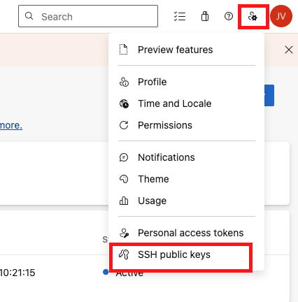

# 🚀 Guia Definitivo: Rodando um Projeto Backend Node.js nos Projetos Vivo

Bem-vindo(a)! Este guia foi elaborado para te ajudar a rodar um projeto backend Node.js nos projetos Vivo, com todos os detalhes necessários para garantir uma experiência tranquila e produtiva. Siga cada etapa com atenção e, ao final, você estará pronto para desenvolver e testar suas aplicações! 😃

---

## 📑 Sumário

1. [Pré-requisitos](#pré-requisitos)
2. [Configurando sua chave SSH no Azure](#1-configurando-sua-chave-ssh-no-azure)
3. [Clonando o repositório](#2-clonando-o-repositório)
4. [Login nos registros Nexus](#3-login-nos-registros-nexus)
5. [Configurando o ambiente do projeto](#4-configurando-o-ambiente-do-projeto)
6. [Criando o arquivo .env](#5-criando-o-arquivo-env)
7. [Subindo o projeto](#6-subindo-o-projeto)
8. [Gerando sua sessão de autenticação](#7-gerando-sua-sessão-de-autenticação)
9. [Referências e links úteis](#referências-e-links-úteis)

---

## Pré-requisitos

Antes de começar, certifique-se de que você possui:

- [Node.js](https://nodejs.org/) instalado em sua máquina.
- [Git](https://git-scm.com/) instalado.
- Acesso aos repositórios Vivo (solicite ao responsável caso ainda não tenha).
- Acesso ao Azure DevOps da Vivo.

> [!TIP]
> Mantenha sempre seu Node.js atualizado e utilize o NVM para gerenciar múltiplas versões!

---

## 1. Configurando sua chave SSH no Azure 🔑

Para garantir acesso seguro aos repositórios, configure uma chave SSH no Azure.

### Gerando sua chave SSH

No terminal, execute os comandos abaixo (substitua `your_email@example.com` pelo seu e-mail):

```bash
ssh-keygen -t rsa -b 4096 -C "your_email@example.com"
cat ~/.ssh/id_rsa.pub | pbcopy
```

> O comando `pbcopy` copia a chave para sua área de transferência. No Windows, abra o arquivo `id_rsa.pub` com um editor de texto e copie manualmente.

### Adicionando a chave no Azure

1. Acesse o **Azure DevOps**.
2. Vá em **User Settings** > **SSH Public Keys** > **+ New Key**.
3. Dê um nome para a chave e cole o conteúdo copiado do seu terminal.
4. Salve a nova chave.



> [!INFO]
> Consulte a [documentação oficial do GitHub](https://docs.github.com/en/authentication/connecting-to-github-with-ssh/generating-a-new-ssh-key-and-adding-it-to-the-ssh-agent#generating-a-new-ssh-key) para mais detalhes.

---

## 2. Clonando o repositório 📦

Com a chave SSH configurada, clone o repositório desejado usando o protocolo SSH:

```bash
git clone git@dev.azure.com:vivo/<nome-do-projeto>.git
```

- Sempre utilize o tipo **SSH** para clonar!
- Ao ser questionado sobre o token no terminal, responda **"yes"**.

---

## 3. Login nos registros Nexus 🔐

Antes de instalar as dependências do projeto (BFF), é necessário autenticar nos registros Nexus da Vivo.

Execute os comandos abaixo no terminal:

```bash
npm login --registry=https://nexus.telefonica.com.br/repository/nodejs/
npm login --registry=https://nexus.telefonica.com.br/repository/framework-brasil-npm/
npm login --registry=https://nexus.telefonica.com.br/repository/fb-app-vivo-npm/
```

Preencha os campos solicitados:

- **Username:** sua matrícula Vivo
- **Password:** senha da matrícula Vivo
- **Email:** seu e-mail Zup

> [!WARNING]
> O login é obrigatório para baixar dependências privadas dos projetos Vivo.

---

## 4. Configurando o ambiente do projeto ⚙️

Abra o diretório do projeto clonado em sua IDE preferida.

### Ajustando a versão do Node.js

É recomendado utilizar o [NVM (Node Version Manager)](https://wikicorp.telefonica.com.br/spaces/D4/pages/607795664/Configura%C3%A7%C3%A3o+do+NPM) para garantir que está usando a versão correta do Node.js.

```bash
nvm install <versão_recomendada>
nvm use <versão_recomendada>
```

### Instalando as dependências

No diretório do projeto, execute:

```bash
npm install
```

---

## 5. Criando o arquivo .env 📝

1. Localize o arquivo `.env.example` na raiz do projeto.
2. Faça uma cópia dele e renomeie para `.env`.
3. Preencha as variáveis de ambiente conforme necessário (consulte a documentação interna ou peça ao responsável pelo projeto).

> [!TIP]
> Nunca compartilhe seu arquivo `.env` fora do time! Ele pode conter informações sensíveis.

---

## 6. Subindo o projeto 🚦

Com tudo configurado, suba seu projeto em modo desenvolvimento:

```bash
npm run start:dev
```

Verifique se não há erros no terminal e aguarde até que a aplicação esteja rodando.

---

## 7. Gerando sua sessão de autenticação 🔑

Para executar chamadas autenticadas nas APIs backend, é necessário gerar uma sessão válida.

Para mais detalhes e download da collection com as APIs para realizar a sessão acesse a [documentação](https://wikicorp.telefonica.com.br/spaces/D4/pages/551196122/02.15+Session+Manager+-+Gerando+Sess%C3%A3o)

### Passos para gerar sessão

1. **Acesse a URL abaixo no navegador:**

   ```
   https://auth.br-pre.baikalplatform.com/authorize?response_type=code&scope=openid%20offline_access&client_id=novum-mytelco&redirect_uri=https%3A%2F%2Fmytelco.io%2F4plogin&claims=%7B%22id_token%22%3A%7B%22extra_attrs_authentication%22%3A%7B%22essential%22%3Atrue%7D%2C%22phone_number%22%3A%7B%22essential%22%3Atrue%7D%2C%22email%22%3A%7B%22essential%22%3Atrue%7D%7D%7D&state=6TEIlXDAUxgRCXTwqqErHI0KUbIJU1oFuIvfHMnjixzTAVOoM95uXsM3MzYNSpPC&purpose=identify-customer%20customer-self-service&device_id=dc5756300ccf4f45b9be9cbdabed8bae&external_idp=OAM12PREPROD
   ```

2. **Realize o login via número Vivo (OTP) ou por CPF:**
   - Massa de teste: senha `135791`
   - CPF: `54963548038`

3. **Copie o parâmetro `code` da URL após o login**
   - Mesmo que a página apresente erro, o código estará na URL.

4. **Utilize o `access_token` obtido para autenticação nas requisições**
   - Consulte a documentação detalhada: [Session Manager - Gerando Sessão](https://wikicorp.telefonica.com.br/spaces/D4/pages/551196122/02.15+Session+Manager+-+Gerando+Sess%C3%A3o)

5. **Recupere a `sessão` gerada no ultimo passo das chamadas**
   - Use a sessão nos headers da sua chamada como valor do campo x-session.

   [x-session](./x-session.png)

> [!INFO]
> Se algum passo falhar, repita o processo ou consulte o responsável técnico do time.

---

## Referências e links úteis 🔗

- [Documentação oficial: Gerar chave SSH](https://docs.github.com/en/authentication/connecting-to-github-with-ssh/generating-a-new-ssh-key-and-adding-it-to-the-ssh-agent#generating-a-new-ssh-key)
- [Configuração do NVM na Vivo (WikiCorp)](https://wikicorp.telefonica.com.br/spaces/D4/pages/607795664/Configura%C3%A7%C3%A3o+do+NPM)
- [Session Manager - Gerando Sessão (WikiCorp)](https://wikicorp.telefonica.com.br/spaces/D4/pages/551196122/02.15+Session+Manager+-+Gerando+Sess%C3%A3o)
- [Node.js Download](https://nodejs.org/)
- [Git Download](https://git-scm.com/)

---

> 😃 **Dúvidas?** Procure o responsável técnico do seu time ou consulte os canais internos da Vivo/Zup!